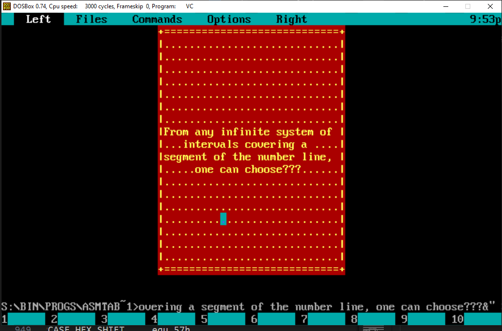

# ASM tablet
Display centered tablet with aligned user text

## Usage
Install DOSBOX

Compile "tablet.asm":
```sh
$ tasm /la tablet.asm
```
Link "tablet.obj"
```sh
$ tlink /t tablet.obj
```
Launch "tablet.com" with args

example:
```sh
$ tablet.com 20 20 4e 1 88 "Happy valentines day@ 14 february! Perfect day to write a dozen lines of assembly code&"
```
## Command Line Arguments

The first two arguments are responsible for the width and length of the frame:
```sh
$ tablet.com [20 20] 4e 1 88 "Happy valentines day@ 14 february&"
```

The next argument is responsible for the color attribute of frame

```sh
$ tablet.com 20 20 [4e] 1 88 "Happy valentines day@ 14 february&"
```

The next argument is responsible for the style mode
If this argument equals zero, you should write string of 9 characters setting the pattern of the frame


```sh
$ tablet.com 20 20 [4e] 0 "+-+|.|+-+" 88 "Happy valentines day@ 14 february&"
```

The next argument is 8bit aligning attribute in hex digit form:
```sh
$ tablet.com 20 20 4e 0 "+-+|.|+-+" [88] "Happy valentines day@ 14 february&"
```
88 = 10001000b - center height/center aligning

>           [x] 1st bit : if = 1 : aligning on the center
>           [x] 2nd bit : if = 1 : aligning on the right edge
>           [x] 3rd bit : <reserved>
>           [x] 4th bit : <reserved>
>           aligns on the left edge by default (1,2 bits = 0)
>
>           [x] 5th bit : if = 1 : aligning to the center height
>           [x] 6th bit : if = 1 : aligning to the bottom
>           [x] 7th bit : <reserved>
>           [x] 8th bit : <reserved>
>           aligns to the top by default (5,6 bits = 0)

The last argument is user string
String supports line break using <@> symbol
String should be ended by <&> simbol
```sh
$ tablet.com 20 20 4e 0 "+-+|.|+-+" 88 ["Happy valentines day@ 14 february&"]
```

## Examples


```sh
$ tablet.com 30 20 4e 1 88 "From any infinite system of intervals covering a segment of the number line, one can choose???"
```